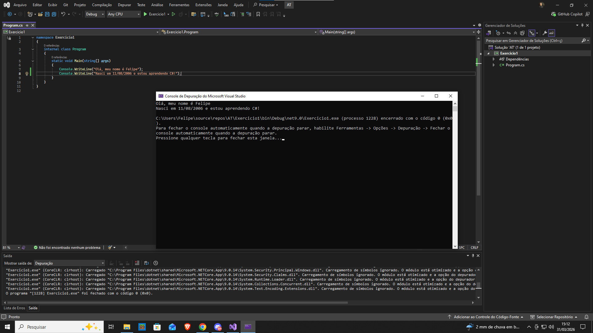



Exercício 1: Criando e Executando seu Primeiro Programa
Enunciado:

Instale e configure o Visual Studio Community 2022.
Crie um novo projeto do tipo Console Application em C#.
No método Main(), escreva um programa que imprima no terminal: Olá, meu nome é [Seu Nome]!
Nasci em [sua data de nascimento] e estou aprendendo C#!
Compile e execute o programa.
Observações:

✔ Envie uma captura de tela do código no Visual Studio.
✔ Envie uma captura de tela da saída do programa.
Critérios de Avaliação:

✔ Configuração correta do ambiente de desenvolvimento.
✔ Uso correto da sintaxe do C#.
✔ Programa funcionando conforme esperado.