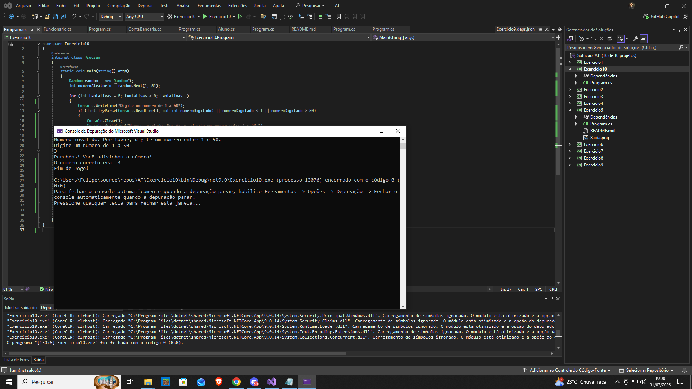



Exercício 10: Jogo de Adivinhação
✔ O usuário deve adivinhar um número de 1 a 50.
✔ Ele tem 5 tentativas.
✔ Se digitar um número fora do intervalo, exibir um erro.
Critérios de Avaliação:

✔ Uso correto de números aleatórios.
✔ Tratamento de exceções funcionando corretamente.
✔ Loop controlando o número de tentativas.
Observações:

✔ Envie uma captura de tela da saída do programa.