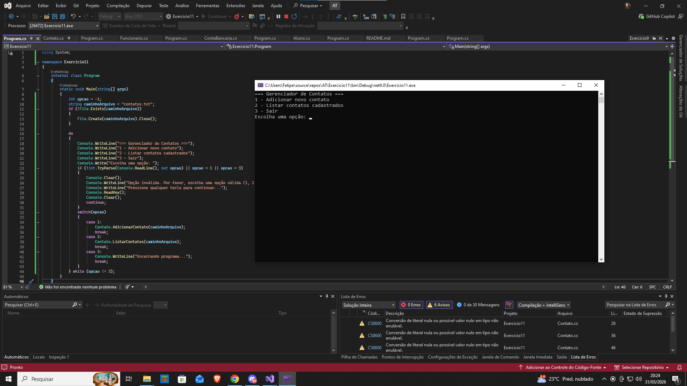



Exercício 11: Manipulação de Arquivos - Cadastro e Listagem de Contatos
Enunciado:

Implemente um programa em C# que permita cadastrar e listar contatos utilizando manipulação de arquivos. Os contatos devem ser armazenados de forma persistente em um arquivo chamado contatos.txt, garantindo que os dados não sejam perdidos ao encerrar o programa.

O programa deve oferecer ao usuário um menu interativo com as seguintes opções:

1 - Adicionar novo contato
2 - Listar contatos cadastrados
3 - Sair

Requisitos Técnicos

Cadastro de Contatos:

O programa deve solicitar ao usuário os seguintes dados para cada contato:
Nome
Telefone
Email
Os contatos devem ser salvos no arquivo contatos.txt, um por linha, seguindo o formato:

João Silva,21 99999-9999,joao@email.com
Maria Oliveira,11 98888-7777,maria@email.com

Listagem de Contatos:

Ao selecionar a opção de listar contatos, o programa deve ler todos os registros do arquivo contatos.txt e exibi-los de forma organizada no console. Caso o arquivo ainda não exista ou não contenha contatos, exibir a mensagem:
Nenhum contato cadastrado.
Encerramento Seguro:

O programa só deve encerrar quando o usuário escolher explicitamente a opção "Sair" no menu.
Critérios de Avaliação

✔ Uso correto de classes para manipulação de arquivos.
✔ Persistência dos dados funcionando corretamente (contatos não devem ser perdidos entre execuções).
✔ Código bem estruturado, modularizado e com boas práticas de programação.
✔ Tratamento adequado de erros, evitando falhas na leitura e gravação do arquivo.
Observações:

✔ Envie uma captura de tela da saída do programa.
Exemplo de Execução

=== Gerenciador de Contatos ===
1 - Adicionar novo contato
2 - Listar contatos cadastrados
3 - Sair
Escolha uma opção: 1
Nome: João Silva
Telefone: (21) 99999-9999
Email: joao@email.com
Contato cadastrado com sucesso!

=== Gerenciador de Contatos ===
1 - Adicionar novo contato
2 - Listar contatos cadastrados
3 - Sair
Escolha uma opção: 2
Contatos cadastrados:
Nome: João Silva | Telefone: (21) 99999-9999 | Email: joao@email.com

=== Gerenciador de Contatos ===
1 - Adicionar novo contato
2 - Listar contatos cadastrados
3 - Sair
Escolha uma opção: 3
Encerrando programa...