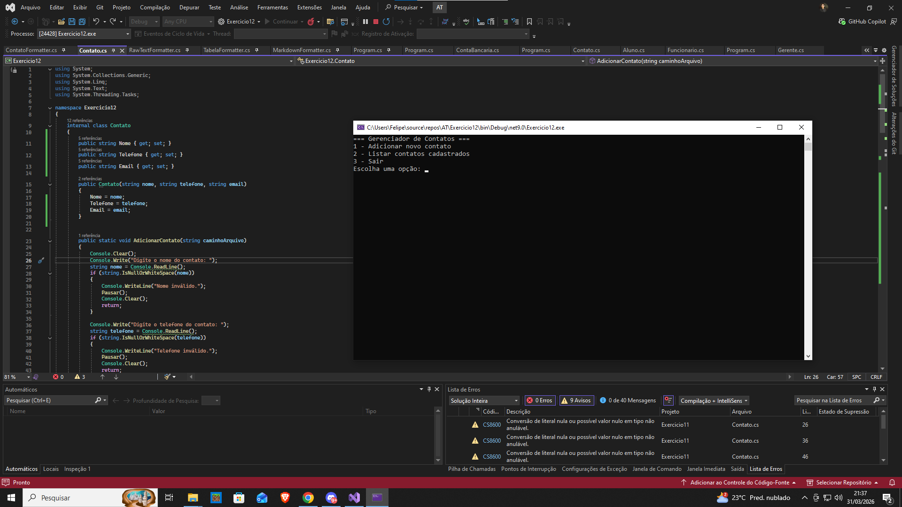



Exercício 12: Manipulação de Arquivos com Herança e Polimorfismo - Formatos de Exibição
Enunciado:

Aprimore o programa de gerenciamento de contatos para permitir diferentes formatos de exibição dos dados utilizando herança e polimorfismo.

O programa deve continuar armazenando os contatos no arquivo contatos.txt, mas agora deve permitir que o usuário escolha como deseja visualizar os dados:

Markdown (formato estruturado para exibição em Markdown)
Tabela (formatado como uma tabela no terminal)
Texto Puro (exibição simples em texto)
Requisitos Técnicos

O programa deve continuar lendo e escrevendo os contatos em um arquivo contatos.txt.
Cada contato deve conter:
Nome
Telefone
Email
O usuário poderá cadastrar novos contatos e escolher entre os três formatos de exibição.
A implementação deve usar herança e polimorfismo:
Criar uma classe base ContatoFormatter que define um método ExibirContatos(List<Contato> contatos).
Criar três classes derivadas (MarkdownFormatter, TabelaFormatter, RawTextFormatter) que implementam o método de exibição de forma diferente.
O programa deve escolher a classe apropriada com base na entrada do usuário.
Detalhamento da Implementação

✔ Classe Contato: Representa um contato com os atributos Nome, Telefone, Email.
✔ Classe base ContatoFormatter: Contém o método virtual ExibirContatos(List<Contato> contatos).
✔ As classes derivadas MarkdownFormatter, TabelaFormatter e RawTextFormatter: Cada uma implementa ExibirContatos(List<Contato> contatos) de forma diferente.
✔ O programa principal (Main):
Permite cadastrar novos contatos.
Lê os contatos do arquivo contatos.txt.
Pergunta ao usuário em qual formato deseja exibir os contatos.
Exibe os contatos conforme a formatação escolhida.
Formato de Exibição

Markdown (MarkdownFormatter)
## Lista de Contatos
- **Nome:** João Silva
- 📞 Telefone: (21) 99999-9999
- 📧 Email: joao@email.com
- **Nome:** Maria Oliveira
- 📞 Telefone: (11) 98888-7777
- 📧 Email: maria@email.com

Tabela (TabelaFormatter)
----------------------------------------
| Nome | Telefone | Email |
----------------------------------------
| João Silva | 21 99999-9999 | joao@email.com |
| Maria Oliveira | 11 98888-7777 | maria@email.com |
----------------------------------------

Texto Puro (RawTextFormatter)
Nome: João Silva | Telefone: (21) 99999-9999 | Email: joao@email.com
Nome: Maria Oliveira | Telefone: (11) 98888-7777 | Email: maria@email.com

Critérios de Avaliação

✔ Uso correto de herança e polimorfismo.
✔ Leitura e escrita no arquivo contatos.txt funcionando corretamente.
✔ Seleção dinâmica da classe de formatação baseada na escolha do usuário.
✔ Código bem estruturado e modularizado.
Observações:

✔ Envie uma captura de tela da saída do programa.