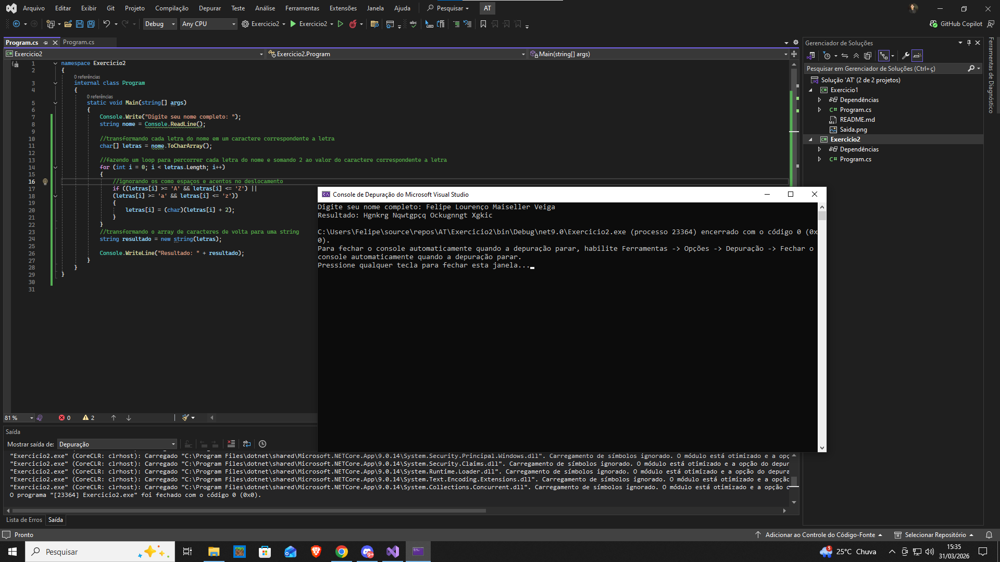



Exercício 2: Manipulação de Strings - Cifrador de Nome
Enunciado:

Crie um programa que receba seu nome completo e desloque cada letra duas posições para frente no alfabeto.

✔ Entrada: "Carlos Silva"
✔ Saída esperada: "Ectnquu Ukngxc"
Observações:

✔ Utilize arrays e manipulação de caracteres.
✔ Ignore espaços e acentos no deslocamento.
✔ Não utilize bibliotecas de criptografia prontas.
✔ Envie uma captura de tela da saída do programa.
Critérios de Avaliação:

✔ Implementação correta do deslocamento.
✔ Uso correto de arrays e manipulação de strings.
✔ Código organizado e comentado.