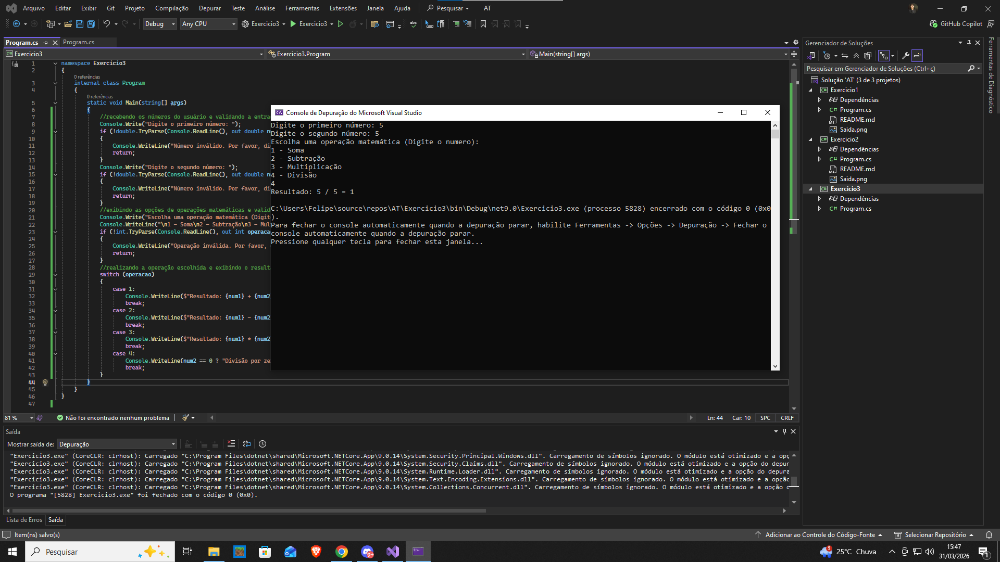



Exercício 3: Calculadora de Operações Matemáticas
Enunciado:

Crie um programa que solicite dois números e peça ao usuário para escolher uma operação matemática:

Soma
Subtração
Multiplicação
Divisão
O programa deve calcular e exibir o resultado da operação escolhida.

Observações:

✔ O programa deve aceitar apenas números válidos.
✔ A operação deve ser escolhida digitando 1, 2, 3 ou 4.
✔ Evite divisões por zero!
✔ Envie uma captura de tela da saída do programa.
Critérios de Avaliação:

✔ Implementação correta da lógica matemática.
✔ Validação de entrada funcionando corretamente.
✔ Código organizado e comentado.