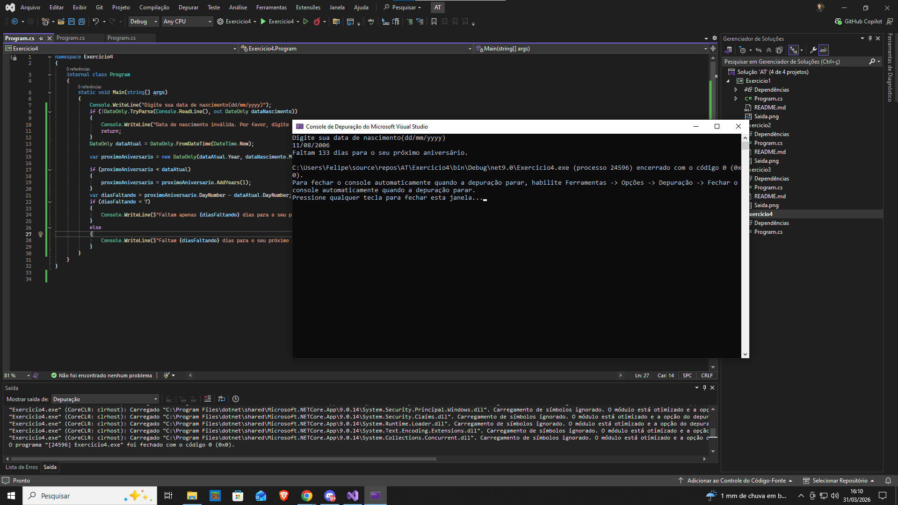



Exercício 4: Manipulação de Datas - Dias até o Próximo Aniversário
Enunciado:

Crie um programa que peça sua data de nascimento e informe quantos dias faltam para seu próximo aniversário.

✔ Regras:

Utilize a classe DateOnly.
Considere anos bissextos.
Se faltar menos de 7 dias, exibir uma mensagem especial.
Observações:

✔ Envie uma captura de tela da saída do programa.
Critérios de Avaliação:

✔ Manipulação correta de datas.
✔ Cálculo correto do intervalo de dias.
✔ Exibição da saída formatada corretamente.