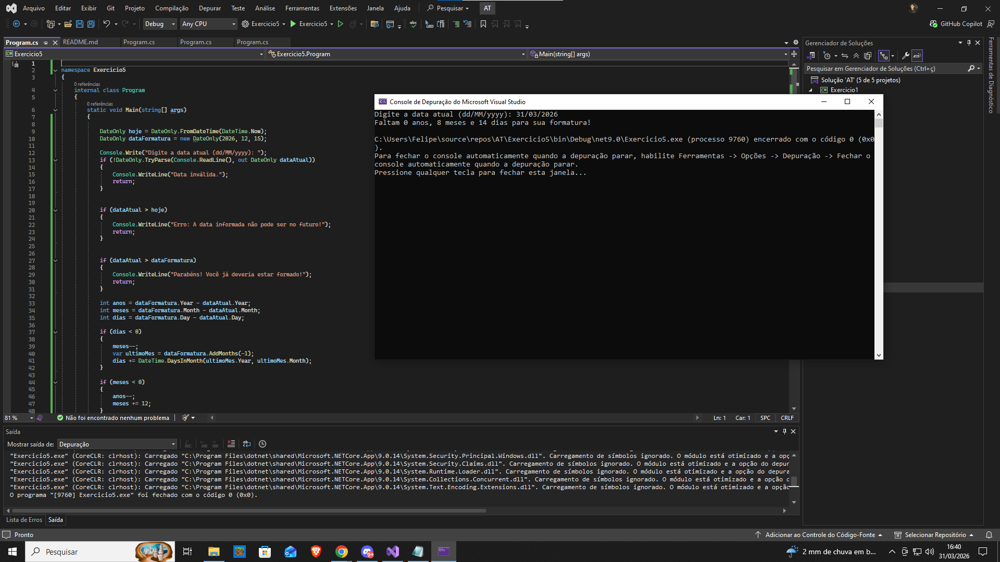



Exercício 5: Tempo Restante para Conclusão do Curso - Diferença Entre Datas
Contexto:

Como estudante do Instituto Infnet que deseja acompanhar quanto tempo falta para sua formatura. Para isso, você decidiu criar um programa que calcula quantos anos, meses e dias restam até a data prevista para a conclusão do curso.

No ambiente acadêmico, a manipulação correta de datas é essencial para organizar prazos de disciplinas, entrega de TCCs, estágios obrigatórios e colação de grau. Este exercício ajudará a desenvolver habilidades fundamentais para a criação de sistemas acadêmicos, como portais do aluno e gerenciadores de calendário acadêmico.

Enunciado:

Implemente um programa que peça ao usuário a data atual e compare com a data prevista de sua formatura (definida manualmente no código). O programa deve exibir:

Saídas esperadas:

✔ Quanto tempo falta para a formatura (anos, meses e dias).
✔ Se faltar menos de 6 meses, exibir a mensagem especial:
A reta final chegou! Prepare-se para a formatura!
✔ Se a data de formatura já tiver passado, exibir a mensagem:
Parabéns! Você já deveria estar formado!
Regras:

✔ O aluno deve definir manualmente sua data prevista de formatura no código.
✔ O programa deve pedir a data atual (input do usuário).
✔ Utilize a classe DateOnly para manipular as datas corretamente.
✔ Evitar erros com datas inválidas (exemplo: usuário inserindo datas futuras como data atual).
Exemplo de Entrada e Saída:

Entrada:

Digite a data atual (dd/MM/yyyy): 10/04/2024

Data de formatura (definida no código):

DateTime dataFormatura = new DateTime(2026, 12, 15);

Saída esperada:

Faltam 2 anos, 8 meses e 5 dias para sua formatura!

Se faltar menos de 6 meses:

Faltam 5 meses e 10 dias para sua formatura!
A reta final chegou! Prepare-se para a formatura!

Se a data de formatura já tiver passado:

Parabéns! Você já deveria estar formado!

Se a data atual for futura:

Erro: A data informada não pode ser no futuro!

Critérios de Avaliação:

✔ Manipulação correta de datas usando DateOnly.
✔ Cálculo correto do tempo restante até a formatura.
✔ Tratamento adequado para datas inválidas (exemplo: usuário inserindo data futura como data atual).
✔ Exibição formatada corretamente e código bem estruturado.
Observações:

✔ Envie uma captura de tela da saída do programa.