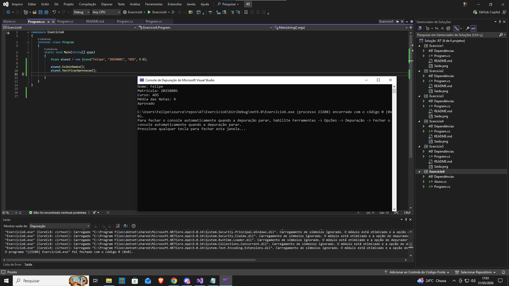



Exercício 6: Cadastro de Alunos
Enunciado:

Crie uma classe Aluno que contenha:

Nome
Matrícula
Curso
Média das Notas
✔ Métodos:

ExibirDados(): Exibe os dados do aluno.
VerificarAprovacao(): Retorna "Aprovado" se a média for ≥ 7, senão "Reprovado".
✔ No Main(), crie um objeto com seus próprios dados e exiba as informações.

Critérios de Avaliação:

✔ Implementação correta da classe e métodos.
✔ Programa principal no método Main().
✔ Código organizado e comentado.
Observações:

✔ Envie uma captura de tela da saída do programa.