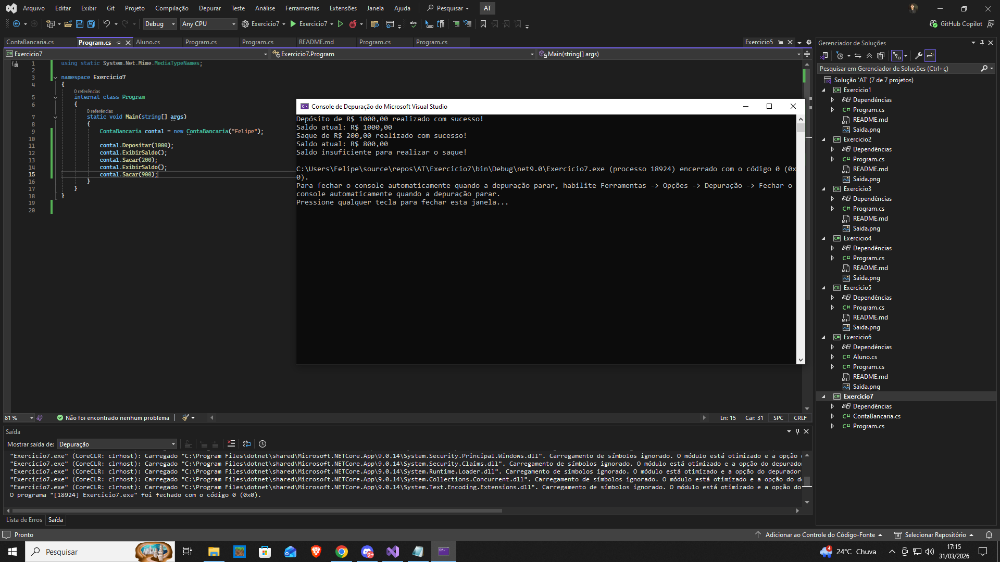



Exercício 7: Banco Digital (Encapsulamento)
Enunciado:

Imagine que você foi contratado para desenvolver um sistema bancário digital para uma fintech inovadora. Neste sistema, é fundamental garantir a segurança e integridade dos dados dos clientes, evitando que informações sensíveis, como o saldo da conta, sejam acessadas ou modificadas diretamente. No mercado de trabalho, o encapsulamento é um princípio essencial da Programação Orientada a Objetos (POO) que protege os dados dentro de uma classe e permite que eles sejam manipulados apenas por meio de métodos específicos. Isso evita alterações indevidas e aumenta a confiabilidade do sistema.

Para garantir essa segurança, sua tarefa será implementar uma classe ContaBancaria que proteja o saldo do usuário, permitindo apenas operações seguras por meio de métodos específicos.

Implemente uma classe ContaBancaria com os seguintes atributos e métodos:

Atributos:

Titular (Nome do cliente, público)
Saldo (privado, não pode ser acessado diretamente)
Métodos:

Depositar(decimal valor): Permite adicionar um valor à conta.
Sacar(decimal valor): Permite retirar um valor, mas somente se houver saldo suficiente.
ExibirSaldo(): Exibe o saldo atual da conta, sem permitir acesso direto ao atributo.
Regras:

✔ O saldo não pode ser acessado diretamente, apenas através dos métodos definidos.
✔ Saque só pode ser realizado se houver saldo suficiente. Caso contrário, exibir a mensagem:
Saldo insuficiente para realizar o saque!
✔ Depósitos não podem ser negativos. Caso contrário, exibir a mensagem:
O valor do depósito deve ser positivo!
✔ O sistema deve impedir que um usuário altere o saldo manualmente.
Exemplo de Uso no Main()

Após implementar a classe, no método Main(), crie um objeto ContaBancaria, simule algumas transações e exiba os resultados.

Exemplo de Saída Esperada:

Titular: João Silva
Depósito de R$ 500,00 realizado com sucesso!
Saldo atual: R$ 500,00
Tentativa de saque: R$ 700,00
Saldo insuficiente para realizar o saque!
Saque de R$ 200,00 realizado com sucesso!
Saldo atual: R$ 300,00

Critérios de Avaliação:

✔ Uso correto de encapsulamento para proteger o saldo da conta.
✔ Implementação correta dos métodos de depósito e saque.
✔ Validação correta para impedir saques indevidos e depósitos negativos.
✔ Código bem estruturado, organizado e comentado.
Observações:

✔ Envie uma captura de tela da saída do programa.
Conclusão:

Ao final deste exercício, você terá aplicado um conceito fundamental da Programação Orientada a Objetos (POO), garantindo segurança e controle sobre os dados de uma aplicação. Este princípio é amplamente utilizado em aplicações bancárias, fintechs, ERPs e sistemas que lidam com informações sensíveis.