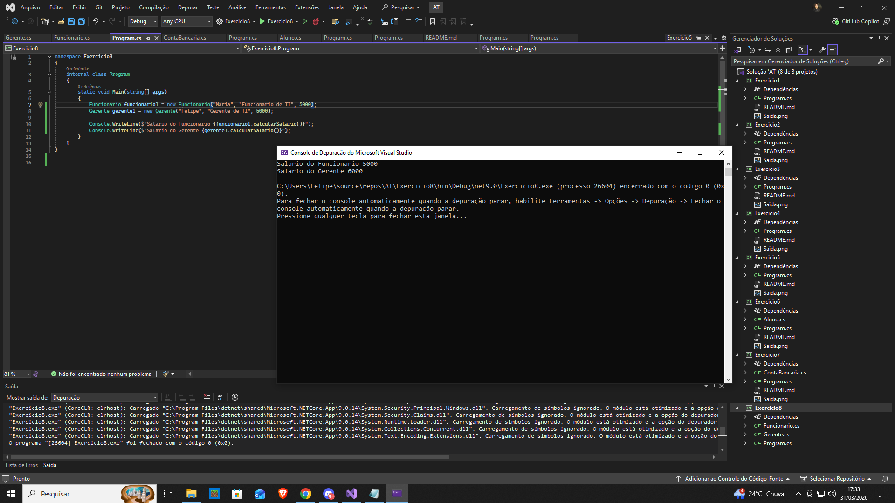



Exercício 8: Cadastro de Funcionários (Herança)
Enunciado:

Crie uma classe Funcionario com:

Nome
Cargo
Salário base
Crie uma classe derivada Gerente que:

Receba um bônus de 20% no salário.
✔ No Main(), crie um objeto de cada classe e exiba os salários corretamente.

Critérios de Avaliação:

✔ Uso correto de herança.
✔ Implementação correta dos cálculos.
✔ Código funcional e organizado.
Observações:

✔ Envie uma captura de tela da saída do programa.